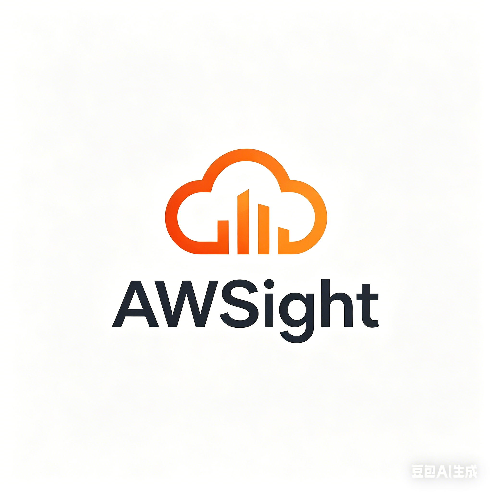

# AWSight — AWS 云端监控移动应用

<p align="center">
 
</p>

<p align="center">
 <strong> 一站式 AWS CloudWatch / ECS / ECR 移动监控面板</strong>
</p>

<p align="center">
 
 
 
 
</p>

---

## 项目概述

**AWSight** 是一款基于 **React Native (Expo)** 构建的开源移动应用，专为 AWS 运维工程师和开发人员设计。通过直接调用 AWS SDK，应用能够在手机上实时查看和管理 AWS CloudWatch 日志、ECS 容器服务以及 ECR 镜像仓库，无需登录 AWS 控制台即可完成日常监控和运维操作。

### 为什么选择 AWSight？

- **零基础设施** — 只需 IAM Access Key，无需部署 Cognito 或后端服务
- **移动优先** — 在手机上随时查看线上服务状态、日志和部署
- **本地凭证管理** — AK/SK 通过 AsyncStorage 加密存储，不过度请求权限
- **完整国际化** — 支持简体中文 / English，跟随系统语言自动切换
- **自动暗色模式** — 跟随系统主题，也可手动切换

---

## 核心功能

### CloudWatch 日志

- 浏览所有日志组和日志流
- 实时查看日志事件（支持搜索和过滤）
- 下拉刷新 + 5 秒自动轮询
- 点击头像弹出 CloudWatch 概览弹窗

### ECS 容器服务

- 集群列表 → 服务列表 → 服务详情全链路导航
- 服务详情页显示完整信息：

| 分类   | 内容                                                     |
| ------ | -------------------------------------------------------- |
| 配置   | Launch Type、Platform Version、Task Definition、调度策略 |
| 部署   | 部署历史、Rollout State、失败任务统计                    |
| 网络   | 负载均衡器、目标组、子网、安全组                         |
| 健康   | Health Check Grace Period、IAM Role                      |
| 事件   | 最近 20 条服务事件日志                                   |
| 容量   | Capacity Provider 策略                                   |
| 注册表 | Service Discovery 注册                                   |

- 任务定义 JSON 查看
- 一键重启服务（Force New Deployment）

### ECR 镜像仓库

- 仓库列表浏览
- 镜像详情查看：Tag、Digest、Size、Push 时间
- 下拉刷新

### IAM 身份

- 显示当前登录用户和状态指示
- STS GetCallerIdentity 获取账号信息

### 主题系统

- 自动跟随系统亮/暗模式
- 手动切换 System / Light / Dark
- `AsyncStorage` 持久化偏好
- 平滑背景色过渡动画（360ms）

### 国际化 (i18n)

- `zh` 简体中文 / `en` English
- 通过 `expo-localization` 检测系统语言
- 日期格式、数值显示均自适应本地化

### 安全

- 敏感数据脱敏记录（Logger）
- 12 小时自动过期
- 登录前凭据验证（先调用 API 验证再保存）

---

## 技术栈

| 层           | 技术                                                                                                      |
| ------------ | --------------------------------------------------------------------------------------------------------- |
| **框架**     | Expo 54 / React Native 0.81                                                                               |
| **语言**     | TypeScript 5.9                                                                                            |
| **包管理**   | Bun 1.2                                                                                                   |
| **AWS SDK**  | `@aws-sdk/client-cloudwatch-logs` / `@aws-sdk/client-ecs` / `@aws-sdk/client-ecr` / `@aws-sdk/client-sts` |
| **状态管理** | Zustand 5 (persist + AsyncStorage)                                                                        |
| **数据请求** | TanStack Query 5 (缓存、重试、轮询)                                                                       |
| **国际化**   | i18next + react-i18next                                                                                   |
| **图标**     | @expo/vector-icons (Ionicons)                                                                             |
| **安全存储** | AsyncStorage（持久化） + 内存脱敏日志                                                                     |

---

## 项目结构

```
src/
 components/ # 可复用组件
 ErrorBoundary.tsx # 全局错误边界
 RipplePressable.tsx # 水波纹按压效果
 hooks/ # TanStack Query hooks
 useCloudWatch.ts # 日志组/流/事件
 useECS.ts # 集群/服务/重启
 useECR.ts # 仓库/镜像
 useECSTaskDef.ts # 任务定义
 useIAM.ts # STS 用户信息
 i18n/
 index.ts # i18next 初始化
 locales/
 en/translation.json
 zh/translation.json
 screens/ # 页面组件
 LoginScreen.tsx # 登录页
 MainTabs.tsx # 主界面 + 导航栏
 LogGroupsScreen.tsx # CloudWatch 日志组
 LogStreamsScreen.tsx # 日志流列表
 LogEventsScreen.tsx # 日志事件详情
 ECSServicesScreen.tsx # ECS 服务管理
 ECRReposScreen.tsx # ECR 仓库
 SettingsScreen.tsx # 设置 + 关于
 DebugLogScreen.tsx # 调试日志查看器
 services/
 auth/auth.ts # 登录/验证/过期
 aws/client.ts # AWS SDK 客户端
 stores/ # Zustand 状态
 authStore.ts # 凭据 + 区域
 loginStore.ts # 登录表单记忆
 uiStore.ts # UI 选择状态
 theme/
 ThemeContext.tsx # 主题系统
 utils/
 logger.ts # 分级日志（DEBUG/INFO/WARN/ERROR）
 rateLimit.ts # 速率限制 + 去重
```

---

## 快速开始

### 前置条件

- [Bun](https://bun.sh/) >= 1.2
- [Expo Go](https://expo.dev/client) App（iOS / Android）
- AWS IAM 用户 Access Key（AKIA 开头）+ Secret Key
- （可选）Node.js 20+

### 安装

```bash
# 克隆项目
git clone https://gitcode.com/ctkqiang_sr/awsight.git
cd awsight

# 安装依赖
bun install

# 启动开发服务器
bun dev
```

### 扫码运行

启动后终端会显示 QR 码：

- **iOS**: 用相机扫码，自动在 Expo Go 中打开
- **Android**: 用 Expo Go App 扫码

### 登录

在登录页输入：

| 字段                  | 说明                               |
| --------------------- | ---------------------------------- |
| **AWS Region**        | 例如 `ap-southeast-*`、`us-east-1` |
| **Access Key ID**     | 以 `AKIA` 开头的 20 位字符         |
| **Secret Access Key** | 40 位字符的密钥                    |

> 建议使用具有 `CloudWatchLogsReadOnly` / `ECSReadOnly` / `ECRReadOnly` 权限的专用 IAM 用户。

---

## 环境变量

`.env` 文件已自动加载（通过 Expo 的 `env` 功能），无需手动配置即可启动。可选配置：

```bash
AWS_REGION=ap-southeast-*
```

---

## 功能截图

### 登录页

- IAM 凭证输入表单
- 密码框安全输入
- 实时格式校验

### 主界面

- 头像环 + 用户名 + 活跃状态
- CloudWatch / ECS / ECR / 设置 四个标签页
- 点击头像弹出 CloudWatch 概览弹窗

### CloudWatch

- 日志组列表搜索
- 日志流 → 日志事件层级导航
- 事件搜索过滤
- 下拉刷新 + 自动轮询

### ECS

- 集群 → 服务两级列表
- 服务详情 12 个分类区域
- 任务定义 JSON 查看
- 服务重启确认弹窗

### ECR

- 仓库列表
- 镜像 Tag / Digest / Size 详情

### 设置

- Region 显示
- 暗色/亮色/系统 主题切换
- 开发者日志查看器
- 关于页面（开源 + 作者 + 版本 + 仓库链接）

---

## 本地开发

```bash
# 启动 Metro 开发服务器
bun dev

# 在 iOS 模拟器上运行
bun ios

# 在 Android 模拟器上运行
bun android

# 重新加载应用（连接设备后按 r）
# 打开调试菜单（连接设备后按 m）
```

### 调试日志

应用内置分级日志系统，在设置页点击「开发者日志」可实时查看：

- `DEBUG` — 细粒度调试信息
- `INFO` — 操作记录（点击、导航、API 成功）
- `WARN` — 警告（权限不足、Region 不标准）
- `ERROR` — 错误（API 失败、异常）

所有日志自动脱敏敏感数据（AK 只显示前 8 位）。

---

## 贡献指南

我们欢迎任何形式的贡献！

### 提交 Issue

- 描述清楚问题复现步骤
- 附上设备型号、操作系统版本、Expo 版本
- 附上 `ErrorBoundary` 或 Debug Logs 中的错误信息

### 提交 Pull Request

1. Fork 本仓库
2. 创建特性分支 `git checkout -b feature/amazing-feature`
3. 提交更改 `git commit -m 'feat: add amazing feature'`
4. 推送到分支 `git push origin feature/amazing-feature`
5. 提交 Pull Request

### 代码规范

- 使用 TypeScript，所有新文件以 `.ts` / `.tsx` 结尾
- 组件使用函数式 `export default function`
- TanStack Query hooks 统一放在 `src/hooks/` 下
- UI 文本使用 `t('key.path')` 进行国际化

---

## 许可证

本项目采用 **MIT** 开源许可证。详见 [LICENSE](LICENSE) 文件。

---

## 关于作者

<table>
 <tr>
 <td align="center">
 <strong>ctkqiang 钟智强</strong>
 </td>
 </tr>
 <tr>
 <td>
 Email: <a href="mailto:johnmelodymel@qq.com">johnmelodymel@qq.com</a><br/>
 微信: ctkqiang<br/>
 开源仓库: <a href="https://gitcode.com/ctkqiang_sr/awsight.git">gitcode.com/ctkqiang_sr/awsight</a>
 </td>
 </tr>
</table>

---

## Star 历史

如果这个项目对你有帮助，请赐予一颗 Star ，你的支持是我们开源的动力！

---

<p align="center">
 Made with by ctkqiang 钟智强
</p>
